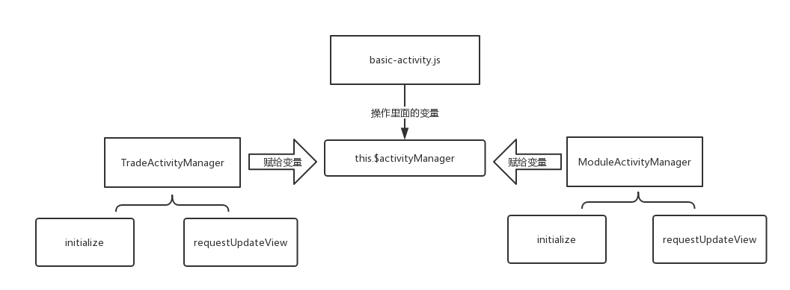
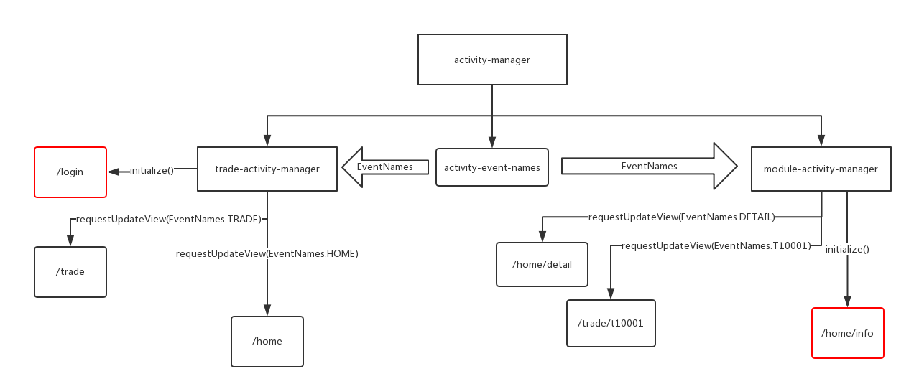

# ab-manager-activity

页面路由管理器，控制页面的跳转。

> 需要一个`activity-manager`和`mixins`配合使用。

1.引入

```js
// main.js

import router from './router' // 相对路径，路由文件
RootActivityManager.router = router;
```

activity-manager文件夹结构：

```
activity-manager
|-- activity-event-names.js    // 定义常量的文件，通过这些常量来识别该如何跳转路由
|-- module-activity-manager.js // 控制二级及以上路由
|-- trade-activity-manager.js  // 控制一级路由
```

2.默认页面跳转：

```js
// app.vue文件

<script>
import { RootActivityManager } from "ab-manager-activity";
import TradeActivityManager from "@/common/activity-manager/trade-activity-manager"; // 相对路径

export default {
  created() {
    // 默认执行TradeActivityManager.initialize()进行路由跳转
    RootActivityManager.changeActivityManager(new TradeActivityManager());
  }
}
</script>
```

3.指定页面跳转：

```js
this.$activityManager.requestUpdateView(name);
```

例：

```js
// 当前.vue文件
<template>
    <div>
        <aui-button @click="login">登录</aui-button>
    </div>
</template>

<script>
import EventNames from "@/common/activity-manager/activity-event-names"; // 相对路径

export default {
  methods: {
    login() {
          this.$activityManager.requestUpdateView(EventNames.LOGINSUCCESS);
    }
  }
}
</script>
```
> basic-activity.js原理图



> 注：`activity-event-names.js`及`trade-activity-manager.js`(与`module-activity-manager类似`)示例代码

```js
// activity-event-names.js

const LOGINSUCCESS = "loginSuccess";//登录成功
export default {
  LOGINSUCCESS
};
```

```js
// trade-activity-manager.js

import EventName from './activity-event-names';
import { RootActivityManager } from 'ab-manager-activity';
import ModuleActivityManager from './module-activity-manager'
export default class TradeActivityManager {
    initialize() {
        this.router.replace('/login');
    }
    requestUpdateView(eventName, eventArgs) {
        console.log("TradeActivityManager:updateView>>>>>>eventName: " + eventName);
        console.log("TradeActivityManager:updateView>>>>>>eventArgs: " + eventArgs);
        if (eventName == EventName.LOGINSUCCESS) {
            this.router.replace("/trade")
        } else {
            RootActivityManager.changeActivityManager(new ModuleActivityManager());
        }
    }
}
```
> activity-manager原理图



| 参数     | 类型 | 说明 |
| -------- | --- | --- |
| name | string | 定义在activity-event-names.js中，表示跳转到哪个页面 |